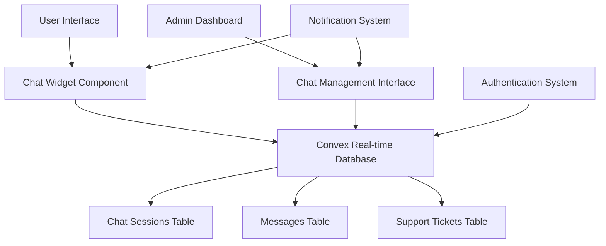

# Design Document

## Overview

The Help Chat System is a real-time communication platform that enables seamless interaction between customers and support staff. The system consists of a user-facing chat widget, an admin dashboard for managing conversations, and a robust backend infrastructure using Convex for real-time data synchronization.

## Architecture

### High-Level Architecture



### Technology Stack

- **Frontend**: Next.js 15 with React 19
- **Backend**: Convex for real-time database and API
- **Styling**: Tailwind CSS (consistent with existing application)
- **Authentication**: Existing Convex auth system
- **Real-time Communication**: Convex subscriptions
- **UI Components**: Existing component patterns with Heroicons and Lucide React

## Components and Interfaces

### 1. User-Facing Components

#### HelpChatWidget
- **Location**: `components/HelpChatWidget.jsx`
- **Purpose**: Floating chat button and expandable chat interface
- **Features**:
  - Minimized state: Floating button with notification badge
  - Expanded state: Full chat interface with message history
  - Auto-resize based on content
  - Responsive design for mobile and desktop

#### ChatInterface
- **Location**: `components/ChatInterface.jsx`
- **Purpose**: Main chat conversation interface
- **Features**:
  - Message bubbles with timestamps
  - Typing indicators
  - Message status indicators (sent, delivered, read)
  - File attachment support (future enhancement)
  - Emoji support

#### UserContactForm
- **Location**: `components/UserContactForm.jsx`
- **Purpose**: Initial contact form for anonymous users
- **Features**:
  - Name and email collection
  - Issue category selection
  - Initial message input
  - Form validation

### 2. Admin Components

#### AdminChatDashboard
- **Location**: `app/admin/chat/page.jsx`
- **Purpose**: Main admin interface for managing all chat sessions
- **Features**:
  - List of active chat sessions
  - Search and filter functionality
  - Real-time notifications for new messages
  - Quick response templates

#### ChatSessionView
- **Location**: `components/admin/ChatSessionView.jsx`
- **Purpose**: Individual chat session management
- **Features**:
  - Full conversation history
  - User information panel
  - Response input with rich text support
  - Ticket status management
  - Internal notes

#### TicketManagement
- **Location**: `components/admin/TicketManagement.jsx`
- **Purpose**: Support ticket tracking and management
- **Features**:
  - Ticket status updates
  - Priority assignment
  - Category tagging
  - Response time tracking

### 3. Shared Components

#### MessageBubble
- **Location**: `components/chat/MessageBubble.jsx`
- **Purpose**: Reusable message display component
- **Features**:
  - Different styles for user/admin messages
  - Timestamp display
  - Message status indicators
  - Support for text and basic formatting

#### TypingIndicator
- **Location**: `components/chat/TypingIndicator.jsx`
- **Purpose**: Shows when someone is typing
- **Features**:
  - Animated dots
  - User identification
  - Auto-hide after timeout

## Data Models

### Chat Sessions Table
```javascript
chatSessions: defineTable({
  sessionId: v.string(), // Unique session identifier
  userId: v.optional(v.id("users")), // Linked user account (optional for anonymous)
  guestInfo: v.optional(v.object({
    name: v.string(),
    email: v.string(),
    phone: v.optional(v.string()),
  })),
  status: v.string(), // 'active', 'waiting', 'closed'
  priority: v.string(), // 'low', 'medium', 'high', 'urgent'
  category: v.optional(v.string()), // 'general', 'order', 'product', 'technical'
  assignedTo: v.optional(v.id("users")), // Admin user ID
  createdAt: v.string(),
  updatedAt: v.string(),
  lastMessageAt: v.string(),
  isActive: v.boolean(),
})
.index("by_status", ["status"])
.index("by_assigned", ["assignedTo"])
.index("by_created", ["createdAt"])
.index("by_last_message", ["lastMessageAt"])
```

### Messages Table
```javascript
chatMessages: defineTable({
  sessionId: v.string(), // Reference to chat session
  senderId: v.optional(v.id("users")), // User ID (null for anonymous)
  senderType: v.string(), // 'user', 'admin', 'system'
  senderName: v.string(), // Display name
  message: v.string(), // Message content
  messageType: v.string(), // 'text', 'image', 'file', 'system'
  isRead: v.boolean(),
  readAt: v.optional(v.string()),
  createdAt: v.string(),
  editedAt: v.optional(v.string()),
  isDeleted: v.optional(v.boolean()),
})
.index("by_session", ["sessionId"])
.index("by_session_created", ["sessionId", "createdAt"])
.index("by_sender", ["senderId"])
```

### Support Tickets Table
```javascript
supportTickets: defineTable({
  ticketNumber: v.string(), // Auto-generated ticket number
  sessionId: v.string(), // Reference to chat session
  userId: v.optional(v.id("users")),
  subject: v.string(),
  description: v.string(),
  status: v.string(), // 'open', 'in_progress', 'resolved', 'closed'
  priority: v.string(), // 'low', 'medium', 'high', 'urgent'
  category: v.string(),
  assignedTo: v.optional(v.id("users")),
  createdAt: v.string(),
  updatedAt: v.string(),
  resolvedAt: v.optional(v.string()),
  closedAt: v.optional(v.string()),
  resolutionNotes: v.optional(v.string()),
  customerSatisfaction: v.optional(v.number()), // 1-5 rating
})
.index("by_status", ["status"])
.index("by_assigned", ["assignedTo"])
.index("by_priority", ["priority"])
.index("by_category", ["category"])
```

## Error Handling

### Client-Side Error Handling
- **Connection Errors**: Graceful degradation with retry mechanisms
- **Message Delivery Failures**: Queue messages locally and retry
- **Authentication Errors**: Redirect to appropriate login pages
- **Validation Errors**: Real-time form validation with user-friendly messages

### Server-Side Error Handling
- **Database Errors**: Proper error logging and user notification
- **Rate Limiting**: Prevent spam and abuse
- **Data Validation**: Server-side validation for all inputs
- **Session Management**: Handle expired sessions gracefully

### Error Recovery Strategies
- **Automatic Reconnection**: Attempt to reconnect on connection loss
- **Message Persistence**: Store messages locally until delivery confirmation
- **Fallback UI**: Show appropriate fallback content during errors
- **Error Reporting**: Log errors for admin review and system improvement

## Testing Strategy

### Unit Testing
- **Component Testing**: Test individual React components with Jest and React Testing Library
- **Utility Functions**: Test message formatting, validation, and helper functions
- **Convex Functions**: Test database operations and business logic

### Integration Testing
- **Real-time Communication**: Test message delivery and synchronization
- **Authentication Flow**: Test user and admin authentication scenarios
- **Database Operations**: Test CRUD operations for all data models

### End-to-End Testing
- **User Journey**: Test complete user chat experience from start to finish
- **Admin Workflow**: Test admin dashboard functionality and ticket management
- **Cross-browser Testing**: Ensure compatibility across different browsers
- **Mobile Responsiveness**: Test chat interface on various device sizes

### Performance Testing
- **Real-time Performance**: Test message delivery speed and reliability
- **Concurrent Users**: Test system performance with multiple simultaneous chats
- **Database Performance**: Monitor query performance and optimize as needed
- **Memory Usage**: Test for memory leaks in long-running chat sessions

## Security Considerations

### Data Protection
- **Input Sanitization**: Sanitize all user inputs to prevent XSS attacks
- **Data Encryption**: Encrypt sensitive data in transit and at rest
- **Access Control**: Implement proper role-based access control
- **Session Security**: Secure session management with proper token handling

### Privacy Compliance
- **Data Retention**: Implement data retention policies for chat history
- **User Consent**: Obtain proper consent for data collection and processing
- **Data Export**: Provide users ability to export their chat data
- **Right to Deletion**: Allow users to request deletion of their chat data

### Admin Security
- **Admin Authentication**: Strong authentication for admin access
- **Audit Logging**: Log all admin actions for security auditing
- **Permission Levels**: Different permission levels for different admin roles
- **Secure Communication**: Ensure all admin communications are encrypted

## Performance Optimization

### Real-time Performance
- **Connection Pooling**: Efficient WebSocket connection management
- **Message Batching**: Batch multiple messages for efficient delivery
- **Lazy Loading**: Load chat history on demand
- **Caching Strategy**: Cache frequently accessed data

### Database Optimization
- **Indexing Strategy**: Proper database indexing for fast queries
- **Query Optimization**: Optimize Convex queries for performance
- **Data Archiving**: Archive old chat sessions to maintain performance
- **Connection Management**: Efficient database connection handling

### UI Performance
- **Virtual Scrolling**: Handle large chat histories efficiently
- **Component Optimization**: Use React.memo and useMemo for performance
- **Image Optimization**: Optimize images and file attachments
- **Bundle Optimization**: Minimize JavaScript bundle size

## Deployment and Monitoring

### Deployment Strategy
- **Environment Configuration**: Separate configurations for development, staging, and production
- **Feature Flags**: Use feature flags for gradual rollout
- **Database Migration**: Safe migration strategy for schema changes
- **Rollback Plan**: Quick rollback strategy in case of issues

### Monitoring and Analytics
- **Real-time Monitoring**: Monitor system health and performance
- **Error Tracking**: Track and alert on system errors
- **Usage Analytics**: Track chat usage patterns and user behavior
- **Performance Metrics**: Monitor response times and system performance

### Maintenance
- **Regular Backups**: Automated backup strategy for chat data
- **System Updates**: Regular updates and security patches
- **Performance Tuning**: Regular performance optimization
- **User Feedback**: Collect and act on user feedback for improvements