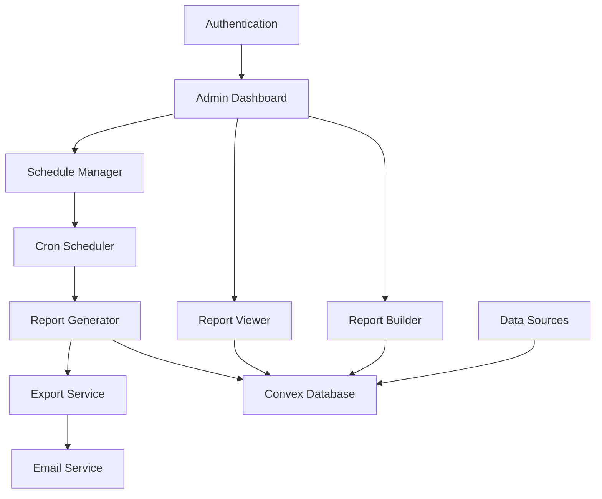

# E-Commerce Reporting System Design

## Overview

The reporting system provides comprehensive analytics and business intelligence capabilities for e-commerce operations. Built on Convex for real-time data synchronization and Next.js for the frontend, it offers flexible report creation, scheduling, and export functionality.

## Architecture

### High-Level Architecture



### Technology Stack

- **Frontend**: Next.js 15 with React 19, Tailwind CSS
- **Backend**: Convex for real-time database and API
- **Scheduling**: Node-cron for report automation
- **Export**: jsPDF for PDF generation, csv-writer for CSV
- **Email**: Nodemailer for report delivery
- **Charts**: Chart.js or Recharts for data visualization
- **Authentication**: Existing Convex auth system

## Database Schema (Convex)

### Report Templates Table
```javascript
reportTemplates: defineTable({
  name: v.string(),
  description: v.string(),
  category: v.string(), // 'sales', 'orders', 'products', 'customers', 'inventory', 'marketing'
  type: v.string(), // 'summary', 'detailed', 'analytical'
  dataSource: v.string(), // Main table/collection to query
  fields: v.array(v.object({
    name: v.string(),
    label: v.string(),
    type: v.string(), // 'string', 'number', 'date', 'currency'
    aggregation: v.optional(v.string()), // 'sum', 'avg', 'count', 'min', 'max'
    format: v.optional(v.string()),
  })),
  filters: v.array(v.object({
    name: v.string(),
    label: v.string(),
    type: v.string(), // 'date', 'select', 'multiselect', 'text', 'number'
    options: v.optional(v.array(v.string())),
    required: v.boolean(),
    defaultValue: v.optional(v.any()),
  })),
  chartConfig: v.optional(v.object({
    type: v.string(), // 'bar', 'line', 'pie', 'table'
    xAxis: v.string(),
    yAxis: v.string(),
    groupBy: v.optional(v.string()),
  })),
  permissions: v.array(v.string()), // Roles that can access this template
  isActive: v.boolean(),
  createdBy: v.id("users"),
  createdAt: v.string(),
  updatedAt: v.string(),
})
```

### Report Instances Table
```javascript
reportInstances: defineTable({
  templateId: v.id("reportTemplates"),
  name: v.string(),
  parameters: v.object({
    filters: v.any(),
    dateRange: v.object({
      start: v.string(),
      end: v.string(),
    }),
    groupBy: v.optional(v.string()),
    sortBy: v.optional(v.string()),
    limit: v.optional(v.number()),
  }),
  status: v.string(), // 'pending', 'generating', 'completed', 'failed'
  data: v.optional(v.any()), // Generated report data
  metadata: v.object({
    recordCount: v.number(),
    generationTime: v.number(), // milliseconds
    dataSize: v.number(), // bytes
  }),
  generatedBy: v.id("users"),
  generatedAt: v.string(),
  expiresAt: v.optional(v.string()),
})
```

### Scheduled Reports Table
```javascript
scheduledReports: defineTable({
  templateId: v.id("reportTemplates"),
  name: v.string(),
  description: v.optional(v.string()),
  schedule: v.object({
    frequency: v.string(), // 'daily', 'weekly', 'monthly', 'custom'
    cronExpression: v.string(),
    timezone: v.string(),
  }),
  parameters: v.object({
    filters: v.any(),
    recipients: v.array(v.string()), // Email addresses
    formats: v.array(v.string()), // 'csv', 'pdf', 'json'
  }),
  isActive: v.boolean(),
  lastRun: v.optional(v.string()),
  nextRun: v.string(),
  runCount: v.number(),
  createdBy: v.id("users"),
  createdAt: v.string(),
  updatedAt: v.string(),
})
```

### Report Exports Table
```javascript
reportExports: defineTable({
  reportInstanceId: v.id("reportInstances"),
  format: v.string(), // 'csv', 'pdf', 'json'
  fileName: v.string(),
  fileSize: v.number(),
  downloadUrl: v.string(),
  status: v.string(), // 'generating', 'completed', 'failed', 'expired'
  generatedBy: v.id("users"),
  generatedAt: v.string(),
  expiresAt: v.string(),
  downloadCount: v.number(),
})
```

### Report Subscriptions Table
```javascript
reportSubscriptions: defineTable({
  userId: v.id("users"),
  scheduledReportId: v.id("scheduledReports"),
  isActive: v.boolean(),
  preferences: v.object({
    formats: v.array(v.string()),
    deliveryTime: v.optional(v.string()),
    includeCharts: v.boolean(),
  }),
  subscribedAt: v.string(),
  lastDelivery: v.optional(v.string()),
})
```

## Component Architecture

### Report Builder Component
```javascript
// components/reports/ReportBuilder.jsx
const ReportBuilder = ({ 
  templateId, 
  onSave, 
  onPreview,
  initialConfig 
}) => {
  // Template selection
  // Filter configuration
  // Field selection
  // Chart configuration
  // Preview functionality
}
```

### Report Viewer Component
```javascript
// components/reports/ReportViewer.jsx
const ReportViewer = ({ 
  reportInstance, 
  onExport, 
  onSchedule,
  allowDrillDown = true 
}) => {
  // Data table with sorting/filtering
  // Chart visualization
  // Export controls
  // Drill-down navigation
}
```

### Schedule Manager Component
```javascript
// components/reports/ScheduleManager.jsx
const ScheduleManager = ({ 
  onCreateSchedule, 
  onUpdateSchedule,
  userPermissions 
}) => {
  // Schedule configuration
  // Recipient management
  // Frequency settings
  // Subscription management
}
```

## API Design (Convex Functions)

### Report Generation
```javascript
// convex/reports.js
export const generateReport = mutation({
  args: {
    templateId: v.id("reportTemplates"),
    parameters: v.object({
      filters: v.any(),
      dateRange: v.object({
        start: v.string(),
        end: v.string(),
      }),
    }),
  },
  handler: async (ctx, args) => {
    // Validate permissions
    // Generate report data
    // Store report instance
    // Return report ID
  },
});
```

### Export Functions
```javascript
export const exportReport = mutation({
  args: {
    reportInstanceId: v.id("reportInstances"),
    format: v.string(),
  },
  handler: async (ctx, args) => {
    // Generate export file
    // Store export record
    // Return download URL
  },
});
```

## Performance Considerations

### Data Optimization
- **Indexing Strategy**: Index on frequently filtered fields (date, category, status)
- **Pagination**: Implement cursor-based pagination for large datasets
- **Caching**: Cache frequently accessed report templates and recent results
- **Async Processing**: Generate large reports asynchronously with progress tracking

### Query Optimization
```javascript
// Optimized query example
const salesReport = await ctx.db
  .query("orders")
  .withIndex("by_date_status", (q) => 
    q.eq("status", "completed")
     .gte("createdAt", startDate)
     .lte("createdAt", endDate)
  )
  .collect();
```

## Security & Privacy

### Access Control
- **Role-Based Permissions**: Admin, Manager, Analyst, Viewer roles
- **Data Filtering**: Automatic filtering based on user department/region
- **Audit Logging**: Track all report access and generation

### PII Protection
```javascript
// Data anonymization for sensitive reports
const anonymizeCustomerData = (data) => {
  return data.map(record => ({
    ...record,
    email: record.email ? maskEmail(record.email) : null,
    phone: record.phone ? maskPhone(record.phone) : null,
  }));
};
```

### Data Retention
- Report instances: 90 days
- Export files: 30 days
- Audit logs: 1 year
- Scheduled report history: 6 months

## Export Formats

### CSV Export
```javascript
const generateCSV = (data, fields) => {
  const csv = Papa.unparse({
    fields: fields.map(f => f.label),
    data: data.map(row => 
      fields.map(f => formatValue(row[f.name], f.type))
    )
  });
  return csv;
};
```

### PDF Export
```javascript
const generatePDF = async (reportData, template) => {
  const doc = new jsPDF();
  
  // Add header
  doc.setFontSize(16);
  doc.text(template.name, 20, 20);
  
  // Add data table
  doc.autoTable({
    head: [template.fields.map(f => f.label)],
    body: reportData.map(row => 
      template.fields.map(f => formatValue(row[f.name], f.type))
    ),
  });
  
  return doc.output('blob');
};
```

## Scheduling System

### Cron Implementation
```javascript
// lib/scheduler.js
import cron from 'node-cron';

export const initializeScheduler = () => {
  // Check for scheduled reports every minute
  cron.schedule('* * * * *', async () => {
    const dueReports = await getDueScheduledReports();
    
    for (const report of dueReports) {
      await generateScheduledReport(report);
    }
  });
};
```

### Email Delivery
```javascript
const sendReportEmail = async (report, recipients, attachments) => {
  const transporter = nodemailer.createTransporter(emailConfig);
  
  await transporter.sendMail({
    from: process.env.REPORTS_EMAIL,
    to: recipients.join(','),
    subject: `Scheduled Report: ${report.name}`,
    html: generateReportEmailTemplate(report),
    attachments: attachments.map(file => ({
      filename: file.name,
      content: file.buffer,
    })),
  });
};
```

## Testing Strategy

### Unit Tests
- Report generation logic
- Data aggregation functions
- Export format generation
- Permission validation

### Integration Tests
- End-to-end report creation flow
- Scheduled report execution
- Email delivery system
- Export file generation

### Performance Tests
- Large dataset handling (1M+ records)
- Concurrent report generation
- Export file size limits
- Memory usage optimization